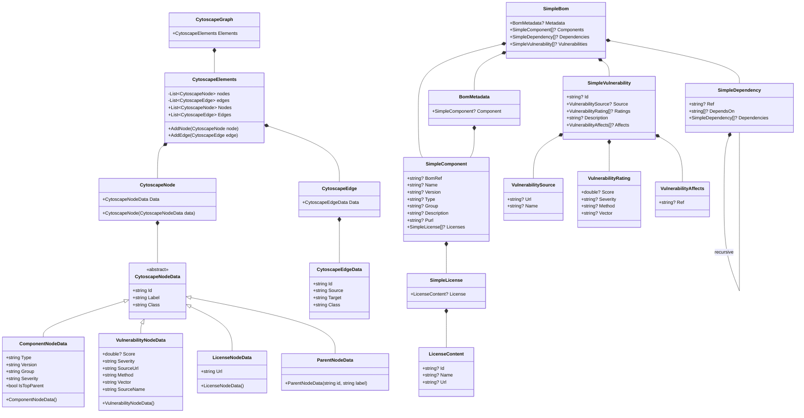

```mermaid
classDiagram
    %% Abstract base classes
    class CytoscapeNodeData {
        <<abstract>>
        +string Id
        +string Label
        +string Class
    }

    %% Cytoscape Models
    class CytoscapeNode {
        +CytoscapeNodeData Data
        +CytoscapeNode(CytoscapeNodeData data)
    }

    class CytoscapeEdgeData {
        +string Id
        +string Source
        +string Target
        +string Class
    }

    class CytoscapeEdge {
        +CytoscapeEdgeData Data
    }

    class CytoscapeElements {
        -List~CytoscapeNode~ nodes
        -List~CytoscapeEdge~ edges
        +List~CytoscapeNode~ Nodes
        +List~CytoscapeEdge~ Edges
        +AddNode(CytoscapeNode node)
        +AddEdge(CytoscapeEdge edge)
    }

    class CytoscapeGraph {
        +CytoscapeElements Elements
    }

    %% Node Data Types (inherit from CytoscapeNodeData)
    class ComponentNodeData {
        +string Type
        +string Version
        +string Group
        +string Severity
        +bool IsTopParent
        +ComponentNodeData()
    }

    class VulnerabilityNodeData {
        +double? Score
        +string Severity
        +string SourceUrl
        +string Method
        +string Vector
        +string SourceName
        +VulnerabilityNodeData()
    }

    class LicenseNodeData {
        +string Url
        +LicenseNodeData()
    }

    class ParentNodeData {
        +ParentNodeData(string id, string label)
    }

    %% SBOM Models
    class SimpleBom {
        +BomMetadata? Metadata
        +SimpleComponent[]? Components
        +SimpleDependency[]? Dependencies
        +SimpleVulnerability[]? Vulnerabilities
    }

    class BomMetadata {
        +SimpleComponent? Component
    }

    class SimpleComponent {
        +string? BomRef
        +string? Name
        +string? Version
        +string? Type
        +string? Group
        +string? Description
        +string? Purl
        +SimpleLicense[]? Licenses
    }

    class SimpleLicense {
        +LicenseContent? License
    }

    class LicenseContent {
        +string? Id
        +string? Name
        +string? Url
    }

    class SimpleDependency {
        +string? Ref
        +string[]? DependsOn
        +SimpleDependency[]? Dependencies
    }

    class SimpleVulnerability {
        +string? Id
        +VulnerabilitySource? Source
        +VulnerabilityRating[]? Ratings
        +string? Description
        +VulnerabilityAffects[]? Affects
    }

    class VulnerabilitySource {
        +string? Url
        +string? Name
    }

    class VulnerabilityRating {
        +double? Score
        +string? Severity
        +string? Method
        +string? Vector
    }

    class VulnerabilityAffects {
        +string? Ref
    }

    %% Relationships
    CytoscapeNodeData <|-- ComponentNodeData
    CytoscapeNodeData <|-- VulnerabilityNodeData
    CytoscapeNodeData <|-- LicenseNodeData
    CytoscapeNodeData <|-- ParentNodeData

    CytoscapeNode *-- CytoscapeNodeData
    CytoscapeEdge *-- CytoscapeEdgeData
    CytoscapeElements *-- CytoscapeNode
    CytoscapeElements *-- CytoscapeEdge
    CytoscapeGraph *-- CytoscapeElements

    SimpleBom *-- BomMetadata
    SimpleBom *-- SimpleComponent
    SimpleBom *-- SimpleDependency
    SimpleBom *-- SimpleVulnerability

    BomMetadata *-- SimpleComponent
    SimpleComponent *-- SimpleLicense
    SimpleLicense *-- LicenseContent
    SimpleDependency *-- SimpleDependency : recursive

    SimpleVulnerability *-- VulnerabilitySource
    SimpleVulnerability *-- VulnerabilityRating
    SimpleVulnerability *-- VulnerabilityAffects

    %% Styling
    classDef abstract fill:#e1f5fe,stroke:#01579b,stroke-width:2px
    classDef cytoscape fill:#f3e5f5,stroke:#4a148c,stroke-width:2px
    classDef sbom fill:#e8f5e8,stroke:#1b5e20,stroke-width:2px
    classDef nodeData fill:#fff3e0,stroke:#e65100,stroke-width:2px


```