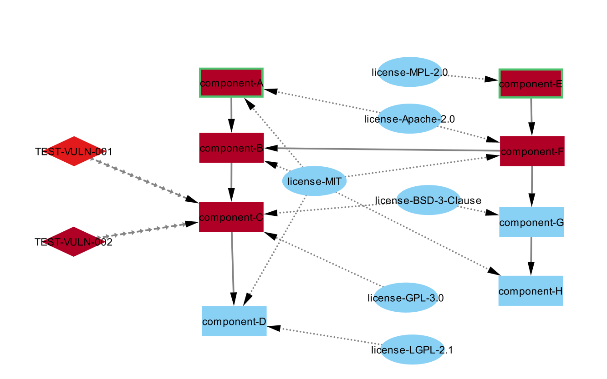
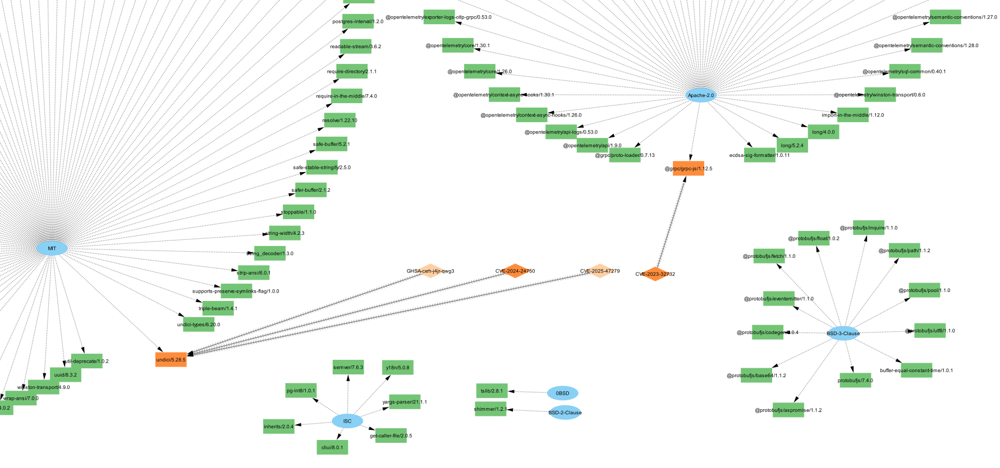

# CycloneDX to Cytoscape Converter (cdx2cyto)

A tool for converting CycloneDX Software Bill of Materials (SBOM) files into Cytoscape.js compatible graph format for visualization and analysis.


Generic view:


view with licenses:


## Introduction

This tool transforms CycloneDX SBOM JSON files into Cytoscape.js graph format, allowing you to visualize software dependencies, vulnerabilities, and license information. The graph representation helps security professionals, developers, and compliance teams to:

- Visualize complex dependency relationships between components
- Identify vulnerable components and understand their impact on the system
- Track license usage across components
- Analyze the software supply chain for security and compliance purposes

## Features

- Convert CycloneDX SBOMs to Cytoscape.js format
- Visualize component dependency trees
- Optional inclusion of vulnerabilities with severity ratings
- Optional inclusion of license information
- Automatic propagation of vulnerability severity up the dependency tree
- Identification of top-level parent components

## Installation

### Prerequisites

- .NET 9.0 SDK or later

### Build from Source

```bash
git clone https://yourrepository/cyclonedx2cytoscape.git
cd cyclonedx2cytoscape
dotnet build
```

## Usage

```bash
cdx2cyto [options] <input-file> <output-file>
```

### Parameters

- `input-file`: Path to CycloneDX SBOM JSON file
- `output-file`: Path to write Cytoscape.js JSON output

### Options

- `--vulns`: Include vulnerability nodes and edges
- `--lic`: Include license nodes and edges
- `--showGroupsInNodeLabels`: Include group names in node labels (default: off for better readability)
- `--only-vex`: Output only vulnerability information in VEX (Vulnerability Exploitability eXchange) mode with console table display and Cytoscape.js file generation
- `--only-vdr`: Output vulnerabilities and affected components in VDR (Vulnerability Disclosure Report) mode with console table display and Cytoscape.js file generation

**Note**: `--only-vex` and `--only-vdr` options are mutually exclusive and provide specialized SBOM analysis modes with vulnerability-focused console output plus standard Cytoscape.js file generation.

**Important**: For vulnerability-related options (`--vulns`, `--only-vex`, `--only-vdr`), the tool only processes vulnerability information that is already present in the input SBOM file. The tool does not perform online vulnerability lookups against databases like NVD (National Vulnerability Database) or GitHub Security Advisories (GHAS). To include vulnerability data, the SBOM must be pre-enriched with vulnerability information using tools like OWASP Dependency-Track, Syft/Grype, or similar SBOM generators.

If no options are specified, only components and their dependencies will be included in the output.

### Examples

Basic conversion (components and dependencies only):
```bash
cdx2cyto path/to/sbom.json output.json
```

Include vulnerability information:
```bash
cdx2cyto --vulns path/to/sbom.json output.json
```

Include license information:
```bash
cdx2cyto --lic path/to/sbom.json output.json
```

Include both vulnerabilities and licenses:
```bash
cdx2cyto --vulns --lic path/to/sbom.json output.json
```

Include group names in node labels:
```bash
cdx2cyto --showGroupsInNodeLabels path/to/sbom.json output.json
```

Combine multiple options:
```bash
cdx2cyto --vulns --lic --showGroupsInNodeLabels path/to/sbom.json output.json
```

Generate VEX (Vulnerability Exploitability eXchange) report:
```bash
cdx2cyto --only-vex path/to/sbom.json output.json
```

Generate VDR (Vulnerability Disclosure Report) with affected components:
```bash
cdx2cyto --only-vdr path/to/sbom.json output.json
```

## VEX and VDR Modes

The tool supports specialized vulnerability reporting modes that provide console-based vulnerability analysis:

**Important**: These modes only process vulnerabilities that are already included in the input CycloneDX SBOM file. The tool does not perform online vulnerability scanning or database lookups. For vulnerability-enriched SBOMs, use tools like OWASP Dependency-Track, Syft with vulnerability scanning, or other SBOM generators that include vulnerability data.

### VEX Mode (--only-vex)
VEX (Vulnerability Exploitability eXchange) mode focuses exclusively on vulnerability information. It provides:
- Deduplicated vulnerability list (removes duplicate CVE entries)
- Color-coded severity display in console table
- Vulnerability summary by severity level
- Clean tabular output with CVE ID, severity, CVSS score, and scoring method
- Standard Cytoscape.js JSON file generation for visualization

Example VEX output:
```
SBOM Component: MyApplication

Found 437 vulnerabilities:
  54 CRITICAL, 194 HIGH, 170 MEDIUM, 18 LOW, 1 UNKNOWN

--------------------------------------------------------
| CVE ID              | Severity | CVSS Score | Method  |
--------------------------------------------------------
| CVE-2024-38999      | CRITICAL | 10.0       | CVSSv3  |
| CVE-2016-1000031    | CRITICAL | 9.8        | CVSSv3  |
| CVE-2019-17571      | CRITICAL | 9.8        | CVSSv3  |
| CVE-2022-23307      | HIGH     | 9.0        | CVSSv2  |
| CVE-2017-9096       | HIGH     | 8.8        | CVSSv3  |
| CVE-2023-1370       | MEDIUM   | 7.5        | CVSSv3  |
| CVE-2021-23337      | MEDIUM   | 7.2        | CVSSv3  |
| CVE-2025-7339       | LOW      | 3.4        | CVSSv3  |
| CVE-2025-32395      | UNKNOWN  | N/A        | other   |
--------------------------------------------------------
```

### VDR Mode (--only-vdr)
VDR (Vulnerability Disclosure Report) mode includes both vulnerabilities and their affected components. It provides:
- All VEX mode features plus affected component information
- Component names and versions in the console table
- Clear mapping between vulnerabilities and components they affect
- Standard Cytoscape.js JSON file generation for visualization

Example VDR output:
```
SBOM Component: MyApplication

Found 437 vulnerabilities affecting 156 components:
  54 CRITICAL, 194 HIGH, 170 MEDIUM, 18 LOW, 1 UNKNOWN

---------------------------------------------------------------------------------------------
| CVE ID              | Severity | CVSS Score | Method  | Components                      |
---------------------------------------------------------------------------------------------
| CVE-2024-38999      | CRITICAL | 10.0       | CVSSv3  | spring-core@5.3.21              |
| CVE-2016-1000031    | CRITICAL | 9.8        | CVSSv3  | commons-fileupload@1.3.3        |
| CVE-2019-17571      | CRITICAL | 9.8        | CVSSv3  | log4j-core@2.17.1               |
| CVE-2022-23307      | HIGH     | 9.0        | CVSSv2  | log4j-core@2.17.1               |
| CVE-2017-9096       | HIGH     | 8.8        | CVSSv3  | jackson-databind@2.13.2.2       |
---------------------------------------------------------------------------------------------
```

### Color Coding
Both modes use color-coded severity levels in the console output:
- **🔴 CRITICAL**: Red highlighting for maximum security impact
- **🟠 HIGH**: Orange highlighting for high security impact  
- **🟡 MEDIUM**: Yellow highlighting for medium security impact
- **🟢 LOW**: Green highlighting for low security impact
- **⚪ UNKNOWN**: No color for unknown or unscored vulnerabilities

The vulnerability counts in the summary are also color-coded to provide immediate visual feedback on the security posture of your SBOM.

## Output Format

The output is a JSON file in Cytoscape.js format with:

- **Nodes** representing:
  - Software components (libraries, frameworks, applications)
  - Vulnerabilities (if enabled)
  - Licenses (if enabled)
- **Edges** representing:
  - Dependencies between components
  - Vulnerability affects relationships
  - License applications to components

Each node and edge includes metadata that can be used for filtering, styling, and analysis in Cytoscape. Component nodes can optionally include group information in their labels if the `--showGroupsInNodeLabels` option is used.

### Node Properties

The generated nodes include several important properties that can be used for visualization and filtering:

- **class**: Categorizes nodes by their type
  - `component`: Software components (libraries, applications, etc.)
  - `vulnerability`: Security vulnerabilities (when `--vulns` is used)
  - `license`: License information (when `--lic` is used)
  - **Usage**: Filter the graph to show only specific types of nodes, or style nodes differently by class

- **group**: The group/organization that created the component (e.g., "org.apache", "com.google")
  - **Usage**: Identify components from the same organization, or highlight specific vendors
  
- **severity**: The security impact level of components with vulnerabilities
  - Values: `critical`, `high`, `medium`, `low`, or `none`
  - Severity is propagated up the dependency tree so parent components inherit the highest severity of their dependencies
  - **Usage**: Quickly identify the most vulnerable components in your dependency tree

- **topParent**: Boolean flag indicating whether a component is at the top of the dependency tree
  - `true`: Component isn't a dependency of other components
  - `false`: Component is a dependency of other components
  - **Usage**: Filter to show only top-level applications or entry points in your software

- **type**: The component type as defined in the CycloneDX SBOM
  - Common values: `library`, `framework`, `application`, etc.
  - **Usage**: Distinguish between different kinds of components in your visualization

- **version**: The version string of the component
  - **Usage**: Identify outdated components or specific versions with known issues

These properties enable powerful visualization and analysis capabilities when imported into Cytoscape, allowing you to:
- Color nodes based on severity to highlight security risks
- Filter the graph to focus on specific component types or vendors
- Identify critical components at the top of the dependency tree
- Group components by organization or other properties

### Edge Properties

Edges represent relationships between nodes and include the following properties:

- **class**: The type of relationship
  - `component`: Dependency relationship between components
  - `vulnerability`: Connection between a vulnerability and affected component
  - `license`: Connection between a license and a component it applies to
  - **Usage**: Style different relationship types distinctly or filter to focus on specific relationships

# Using Cytoscape for Visualization

This section provides guidance on how to use Cytoscape to visualize and analyze the output files generated by the cdx2cyto tool.

## Installing Cytoscape

1. **Download Cytoscape**:
   - Visit the [Cytoscape download page](https://cytoscape.org/download.html)
   - Select the version appropriate for your operating system (Windows, Mac, or Linux)
   - Download and run the installer

2. **System Requirements**:
   - 4GB RAM minimum (8GB+ recommended)
   - Java 11 or later (included in the installer)
   - Modern CPU (2GHz+)

3. **First Launch**:
   - Launch Cytoscape after installation
   - You can optionally install additional apps via Apps → App Manager

## Importing Your SBOM Graph

1. **Import the JSON file**:
   - Select File → Import → Network from File
   - Navigate to and select your output JSON file
   - Choose "Cytoscape.js JSON" as the file format
   - Click "Import"

2. **Adjust Initial View**:
   - Once imported, the network will be displayed in the main window
   - If the network is not visible, select View → Fit Content

## Layout Options

The layout is crucial for understanding the dependency relationships. Here are recommended layouts for SBOM visualization:

1. **Hierarchical Layout**:
   - Select Layout → Hierarchical Layout
   - This layout works well for dependency trees, placing top-level components at the top and dependencies below

2. **Force-Directed Layout**:
   - Select Layout → Force Directed Layout
   - Good for general visualization that emphasizes clusters

3. **Radial Layout**:
   - Select Layout → Radial Layout
   - Useful when you want to focus on a central component and its dependencies

4. **Circular Layout**:
   - Select Layout → Circular Layout
   - Particularly effective for large datasets with many components
   - Arranges nodes in a circle with minimal edge crossings
   - Helpful for identifying patterns in complex dependency networks
   - Makes efficient use of screen space when dealing with hundreds of components
   - Can be combined with filtering to focus on specific subsections of large SBOMs

5. **Layout Settings**:
   - Adjust layout parameters by clicking on Layout → Settings for each layout type
   - For hierarchical layouts, set "Direction" to "Top-to-Bottom" for traditional dependency trees
   - For circular layouts, adjust the "Node spacing" parameter to optimize readability

## Working with Node and Edge Tables

Cytoscape provides tabular views of your nodes and edges with all their attributes:

1. **Accessing Tables**:
   - Click on "Table Panel" at the bottom of the screen
   - Switch between "Node Table" and "Edge Table" tabs

2. **Exploring Data**:
   - The Node Table shows all components, vulnerabilities, and licenses with their attributes
   - The Edge Table shows relationships with their types

3. **Sorting and Filtering in Tables**:
   - Click on column headers to sort
   - Use the filter icon in each column to filter based on attribute values
   - For components, sort by "Severity" to quickly identify vulnerable components

4. **Selecting from Tables**:
   - Click on rows to select the corresponding nodes/edges in the network view
   - Hold Ctrl/Cmd to select multiple items

## Styling Your Network

The visual appearance can significantly enhance understanding of your SBOM:

1. **Open the Style Panel**:
   - Click on the "Style" tab in the left panel

2. **Node Styling**:
   - **By Class (Node Type)**:
     ```
     Style → Node → Fill Color → Column: Data.Class
     Map "component" to blue, "vulnerability" to red, "license" to green
     ```

   - **By Component Type**:
     ```
     Style → Node → Fill Color → Column: Data.Type
     Map type "library" to blue, "framework" to green, "application" to purple, etc.
     ```

   - **By Severity**:
     ```
     Style → Node → Fill Color → Column: Data.Severity
     Map "critical" to red, "high" to orange, "medium" to yellow, "low" to blue, "none" to gray
     ```

   - **By Top Parent Status**:
     ```
     Style → Node → Border Width → Column: Data.TopParent
     Map "true" to 5, "false" to 1
     Style → Node → Border Style → Column: Data.TopParent
     Map "true" to solid, "false" to dotted
     ```

   - **Shape by Node Class**:
     ```
     Style → Node → Shape → Column: Data.Class
     Map "component" to ellipses, "vulnerability" to diamonds, "license" to rectangles
     ```
     
   - **Group Information**:
     ```
     Style → Node → Border Color → Column: Data.Group
     ```

   - **Version Visualization**:
     ```
     Style → Node → Label Font Size → Column: Data.Version
     Use a mapping to make newer versions have larger font size
     ```

3. **Edge Styling**:
   - **By Class**:
     ```
     Style → Edge → Line Color → Column: Data.Class
     Map "component" to gray, "vulnerability" to red, "license" to green
     ```

   - **Line Style**:
     ```
     Style → Edge → Line Type → Column: Data.Class
     Map "component" to solid, "vulnerability" to dashed, "license" to dotted
     ```

4. **Labels**:
   - Configure node labels:
     ```
     Style → Node → Label → Column: Data.Label
     ```

5. **Save Styles**:
   - Create and save different styles for different analysis needs
   - File → Save Style

## Filtering Networks

Filtering helps focus on specific aspects of the SBOM:

1. **Using the Filter Panel**:
   - Open the "Filter" tab in the right panel
   - Click "+" to add a filter

2. **Filter by Node Class**:
   - Select "Column Filter"
   - Choose "Data.Class" column
   - Select one or more values: "component", "vulnerability", "license"
   - **Example**: Show only components and vulnerabilities, hiding licenses

3. **Filter by Component Properties**:
   - **Top-level Components**:
     ```
     Column Filter → Data.TopParent = true
     ```
     Shows only components that aren't dependencies of other components

   - **Specific Groups/Vendors**:
     ```
     Column Filter → Data.Group contains "apache"
     ```
     Shows only components from a specific organization

   - **Component Types**:
     ```
     Column Filter → Data.Type = "library"
     ```
     Shows only libraries, filtering out applications, frameworks, etc.

4. **Filter by Vulnerability Severity**:
   - Create a filter for critical and high severity vulnerabilities:
     ```
     Column Filter → Data.Severity = "critical" OR Data.Severity = "high"
     ```
   - Find all vulnerable components:
     ```
     Column Filter → Data.Severity ≠ "none"
     ```

5. **Filter by Edge Type**:
   - Show only dependency relationships:
     ```
     Column Filter → Data.Class = "component"
     ```
   - Show only vulnerability relationships:
     ```
     Column Filter → Data.Class = "vulnerability"
     ```

6. **Combine Filters for Complex Queries**:
   - Find critical vulnerabilities in top-level components:
     ```
     (Data.Severity = "critical") AND (Data.TopParent = true)
     ```
   - Find all components from a specific vendor with any vulnerabilities:
     ```
     (Data.Group contains "apache") AND (Data.Severity ≠ "none") AND (Data.Class = "component")
     ```

7. **Save and Reuse Filters**:
   - Save filter combinations for future use
   - Click on the save icon in the Filter panel

## Practical Examples

### Example 1: Dependency Analysis for Top-level Components

1. Apply a filter: `Data.TopParent = true`
2. This will show only the root-level components that aren't dependencies of other components
3. For each top-level component:
   - Select it and use Layout → Radial Layout centered on the selected node
   - Use First Neighbors selection to see direct dependencies
   - Color dependencies by severity to identify risk
4. This approach helps focus on the most important components in your application

### Example 2: Vulnerability Impact Analysis

1. Create a style where node color is based on severity:
   ```
   Style → Node → Fill Color → Column: Data.Severity
   Map "critical" to bright red, "high" to orange, "medium" to yellow, "low" to blue, "none" to light gray
   ```
2. Create a style where node size is based on dependency count:
   ```
   Style → Node → Size → Column: Degree
   ```
3. Apply a filter to show only affected components:
   ```
   Data.Severity ≠ "none"
   ```
4. Use a hierarchical layout to visualize how vulnerabilities propagate up the dependency tree
5. Components with both high severity and many dependencies represent the highest risk in your software

### Example 3: Vendor Risk Assessment

1. Create a style where node border color represents the vendor/group:
   ```
   Style → Node → Border Color → Column: Data.Group
   ```
2. Group components by their group/vendor in the Node Table
3. Sort by severity to identify which vendors introduce the most security risk
4. Create a pie chart visualization using the group and severity data to present vendor risk distribution

### Example 4: License Compliance Check

1. Filter to show only license relationships:
   ```
   Edge: Data.Class = "license"
   ```
2. Color license nodes by type:
   ```
   Style → Node → Fill Color → Column: Data.Label
   ```
3. Use the Table Panel to list all components with specific licenses
4. Identify components with restrictive licenses that might affect your deployment options

## Sample Files

The repository includes example files in the `example` folder to help you get started quickly:


- `test-dependency-tree-full.json` - A sample CycloneDX SBOM file containing:
  - 8 component nodes (A through H) with dependencies
  - 6 unique licenses (MIT, Apache-2.0, GPL-3.0, BSD-3-Clause, LGPL-2.1, MPL-2.0)
  - 2 vulnerabilities affecting component C (one high, one critical)

- `test-dependency-tree-full.json.cyjs` - The corresponding Cytoscape.js output file generated using:
  ```bash
  cdx2cyto --vulns --lic example/test-dependency-tree-full.json example/test-dependency-tree-full.json.cyjs
  ```

- `example_styles.xml` - A Cytoscape style file that can be imported to properly visualize the different node and edge types

- `ExampleSession.cys` - A pre-configured Cytoscape session file with the example data already loaded and styled

## Example Visualization

Below is an example visualization of the sample SBOM data:


The visualization shows:

1. **Component Dependency Tree** - The relationships between components A through H
2. **Vulnerability Impact** - The critical vulnerability in component C propagating up to components B, A, F, and E
3. **License Relationships** - The various licenses applying to different components
4. **Top-Level Components** - Components A and E are marked as top-level parent components

## Using the Example Files

1. **Generate a similar output**:
   ```bash
   dotnet run -- --vulns --lic example/test-dependency-tree-full.json output.json
   ```

   Or with group names included in node labels:
   ```bash
   dotnet run -- --vulns --lic --showGroupsInNodeLabels example/test-dependency-tree-full.json output.json
   ```

2. **Import the example into Cytoscape**:
   - Open Cytoscape
   - File → Import → Network from File → Select `test-dependency-tree-full.json.cyjs`
   - File → Import → Style from File → Select `example_styles.xml`
   - Apply the imported style to your network

3. **Or open the pre-configured session**:
   - File → Open → Select `ExampleSession.cys`

This example demonstrates the full capabilities of the cdx2cyto tool, including:
- Component dependency visualization
- Vulnerability propagation and severity indication
- License relationship mapping
- Proper styling and layout
## External Resources

For more information on using Cytoscape effectively, refer to these resources:

- [Cytoscape User Manual](https://manual.cytoscape.org/en/stable/)
- [Cytoscape Tutorials](https://tutorials.cytoscape.org/)
- [Cytoscape App Store](https://apps.cytoscape.org/) - for additional plugins
- [Cytoscape.js Documentation](https://js.cytoscape.org/) - for understanding the JSON format
- [CycloneDX Specification](https://cyclonedx.org/specification/overview/) - for understanding SBOM structure
- [OWASP Dependency-Track](https://dependencytrack.org/) - companion tool for SBOM management
- [NIST Software Supply Chain Security Guidance](https://www.nist.gov/itl/executive-order-14028-improving-nations-cybersecurity/software-security-supply-chains) - best practices


With these techniques, you can effectively analyze and visualize your software dependencies, vulnerabilities, and licenses to improve your software supply chain security posture.
